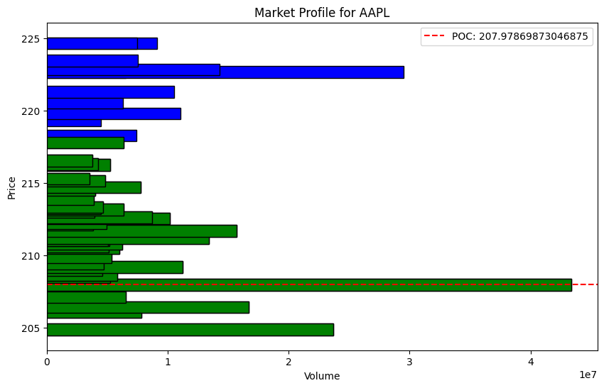

# Market-Profile

## Introduction:

Market Profile is a powerful tool used by traders to analyze market structure and make informed trading decisions. Developed by J. Peter Steidlmayer in the 1980s, Market Profile offers a unique way of organizing price data over time, providing insights into the market's perceived value and helping traders identify key levels of support and resistance.

In this project, how we can implement it using Python. We'll also discuss how to interpret the output generated by our Python project.

## What is Market Profile?

Market Profile is a charting technique that organizes price data into a distribution, allowing traders to visualize the amount of trading activity at different price levels.

Key Concepts of Market Profile:
1) **Time Price Opportunity (TPO):** Represents the price levels that were traded during specific time intervals. On a Market Profile chart, TPOs are used to indicate how frequently each price level was traded during a session.

2) **Value Area:** The range of prices where 70% of the trading activity occurred during a session. This area represents the market's perceived fair value.

3) **Point of Control (POC):** The price level with the highest volume during the session. The POC is often a key level of support or resistance.

4) **Initial Balance (IB):** The range of prices traded during the first hour of the trading session. It provides early insight into the day's market structure.

By analyzing these components, traders can identify important price levels, potential breakout points, and areas where the market may be overbought or oversold.

## Interpreting the Output:

The output of our Python project is a Market Profile chart that displays the volume traded at each price level.



* **Volume Distribution:** The horizontal bars show the volume traded at each price level during the specified period. Longer bars indicate more trading activity at that price.

* **Value Area (Green Bars):** The green portion of the chart highlights the Value Area, where 70% of the trading activity occurred. This is the market's perceived fair value range.

* **Point of Control (Red Line):** The red dashed line represents the Point of Control (POC), which is the price level with the highest volume. This level often acts as a strong support or resistance.

* **Trading Insights:** By analyzing the Market Profile, traders can identify key levels where the market is likely to react. For example, if the price is above the Value Area, it may indicate overbought conditions, while a price below the Value Area may suggest oversold conditions.


## Environment


```BASH
pyenv local 3.11.3
python -m venv .venv
source .venv/bin/activate
pip install --upgrade pip
```


**Disclaimer:** The information provided in this project is for educational purposes only and does not constitute financial or investment advice. Trading involves risk, and it is important to conduct thorough research and consult with a financial advisor before making any investment decisions.